<p align="center">

</p>

# UNH Student Feedback

[](https://creativecommons.org/licenses/by/4.0/)
[](https://github.com/unhorizons/report-manager/actions/workflows/lint.yaml)

Application Web de gestion de rapport de l'administration UNH

## Attributions des rôles
- Bernard Ngandu, président club info UNH (Chef de projet)
- Robert Makila, Info. Sec. Adviser

### Conditions requises

- [Docker](https://www.docker.com/) : Un conteneur est une unité logicielle standard qui regroupe le code et toutes ses dépendances, de sorte que l'application s'exécute rapidement et de manière fiable d'un environnement informatique à un autre.

## Installation et fonctionnement

```bash
git clone https://github.com/unhorizons/report-manager report
cd report
```
Après avoir cloné le projet, vous devez installer les dépendances requises en exécutant la commande suivante dans le dossier du projet

Pour éviter les problèmes de permission avec docker, assurez-vous que les deux variables d'environnement suivantes sont définies sur votre machine
```bash
# dans .bashrc ou .zshrc 
export USER_ID=$(id -u)
export GROUP_ID=$(id -g)
```

Vous pouvez également ajouter un alias pour faciliter l'exécution de la commande dans le conteneur

```bash
# dans .bashrc ou .zshrc
alias dr="USER_ID=$(id -u) GROUP_ID=$(id -g) docker-compose run --rm"

# exemples
# dr [service] command

dr php bin/console c:c
dr node yarn install
```

en suite
```bash
make install
```

Finalement vous pouvez lancer l'application avec 👇🏾.
```bash
make dev
```

## Comment contribuer

Les contributions sont encouragées et peuvent être soumises en "fork" de ce projet et en soumettant une demande de modification (pull request). Comme ce projet n'en est qu'à ses débuts, si votre modification est substantielle, veuillez d'abord soulever un problème (Issue) pour en discuter.

Nous avons également besoin de personnes pour tester le pull requests. Jetez donc un coup d'œil sur [les problèmes ouverts](https://github.com/devscast/devscast.org/issues) et aidez-nous si vous le pouvez.

**Pour plus d'info, lisez le [CONTRIBUTING.md](https://github.com/devscast/devscast.org/blob/master/CONTRIBUTING.md "CONTRIBUTING.md")**


### Code style et tests
Si vous constatez que l'une de votre pull reviews ne passe pas la vérification du serveur CI en raison d'un conflit de style de code, vous pouvez facilement le corriger en exécutant :

```bash
make lint 
make test
```

### contributors

<a href="https://github.com/unhorizons/report-manager/graphs/contributors">
  
</a>

## Screenshots

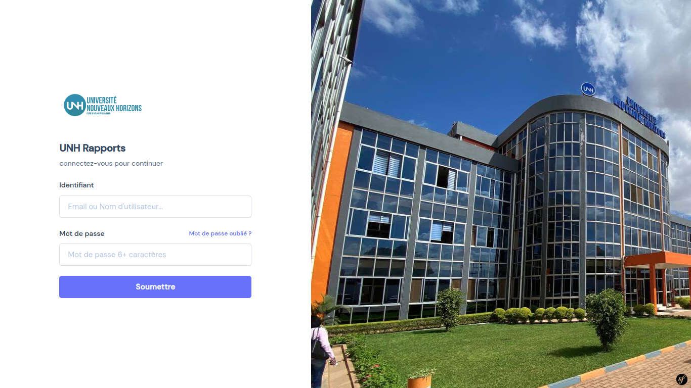
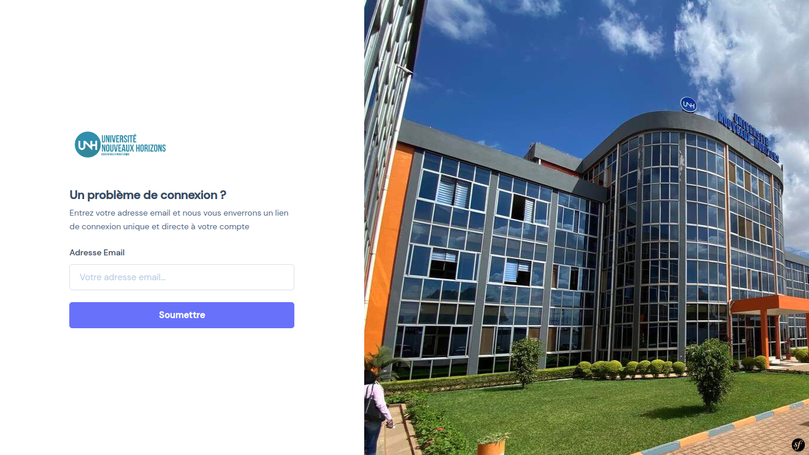
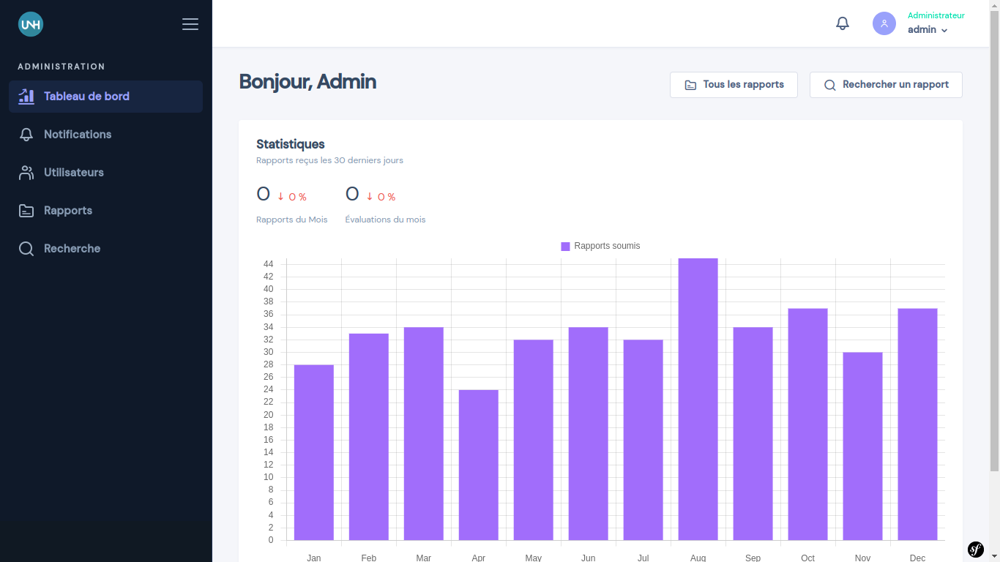
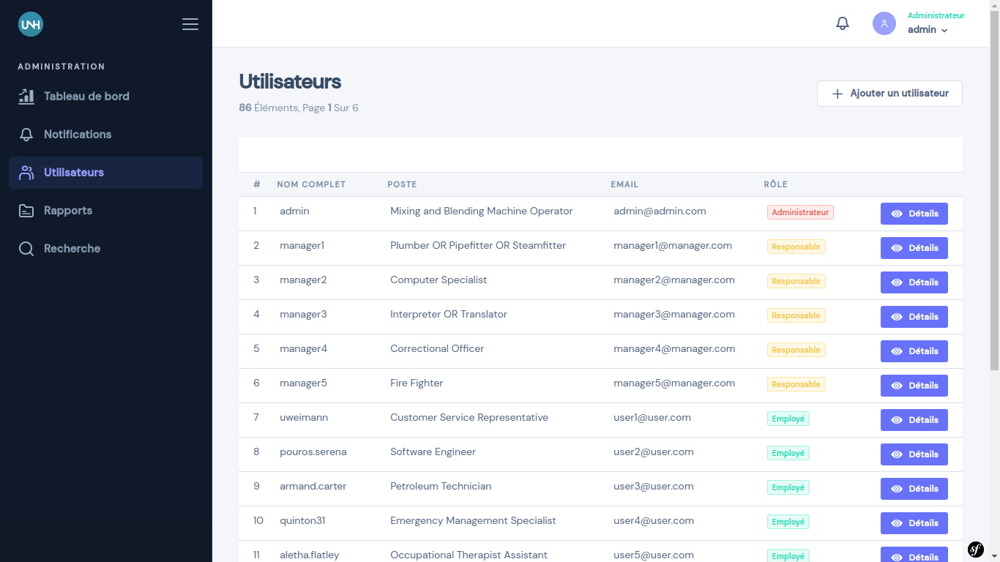
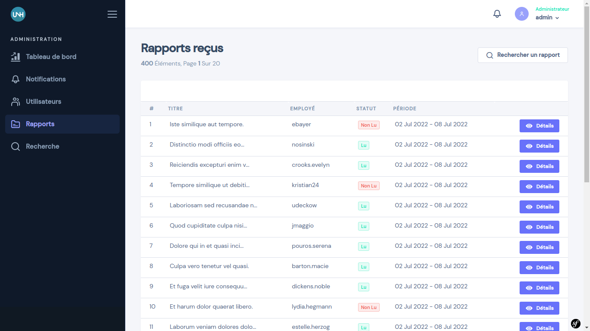
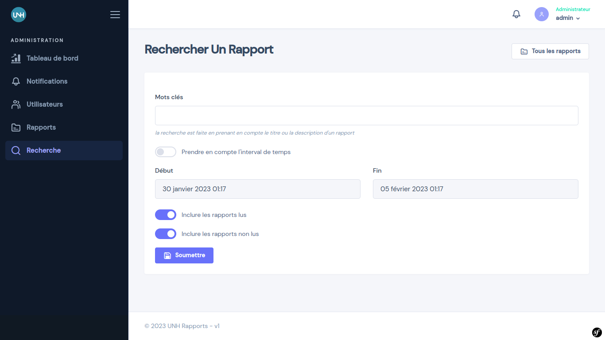
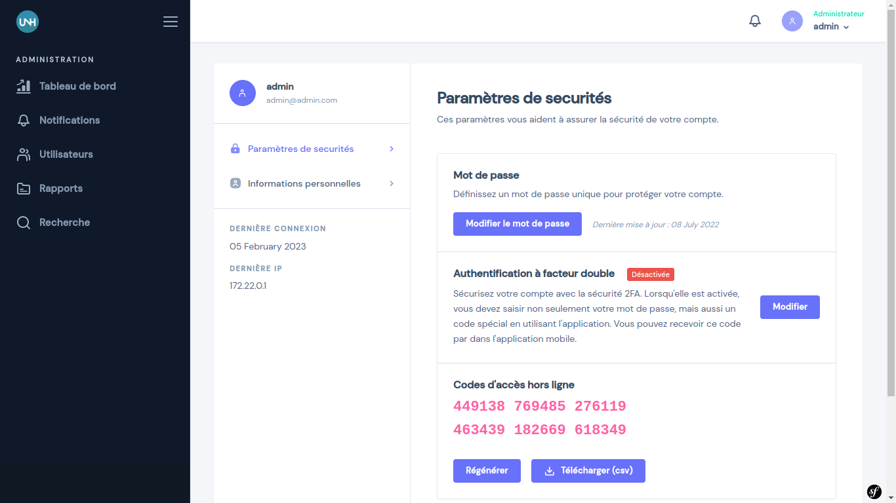
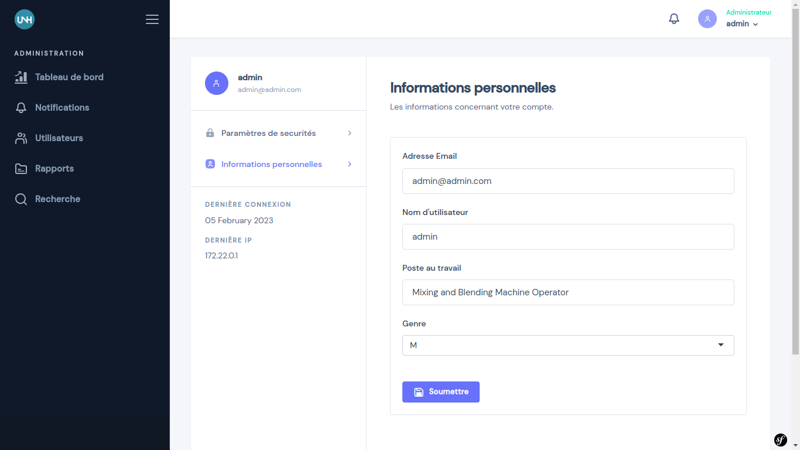
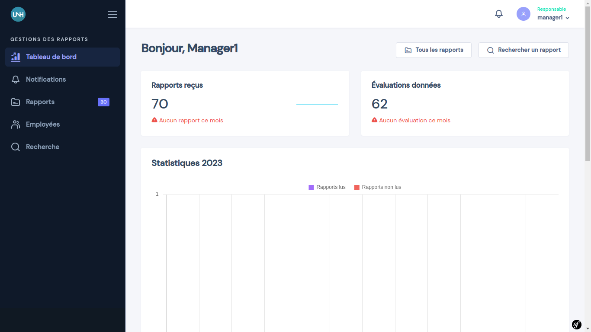
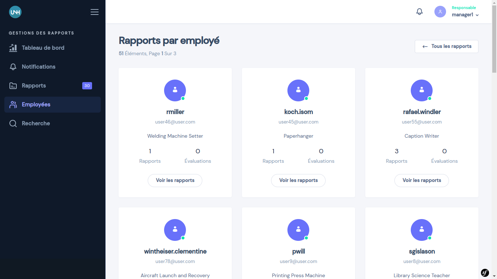
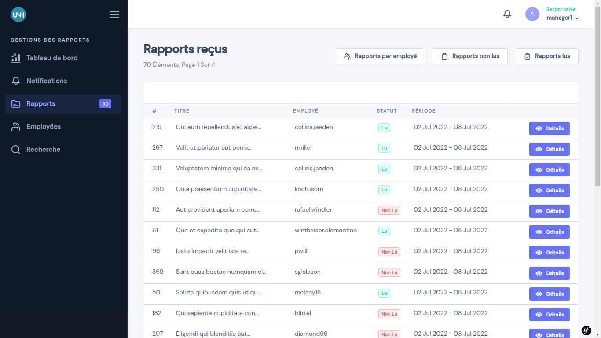
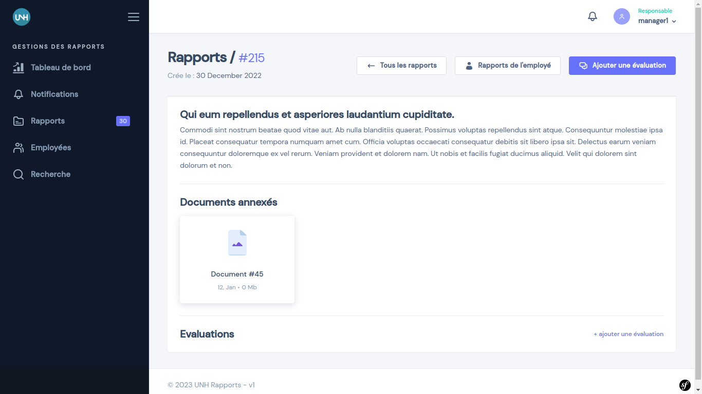
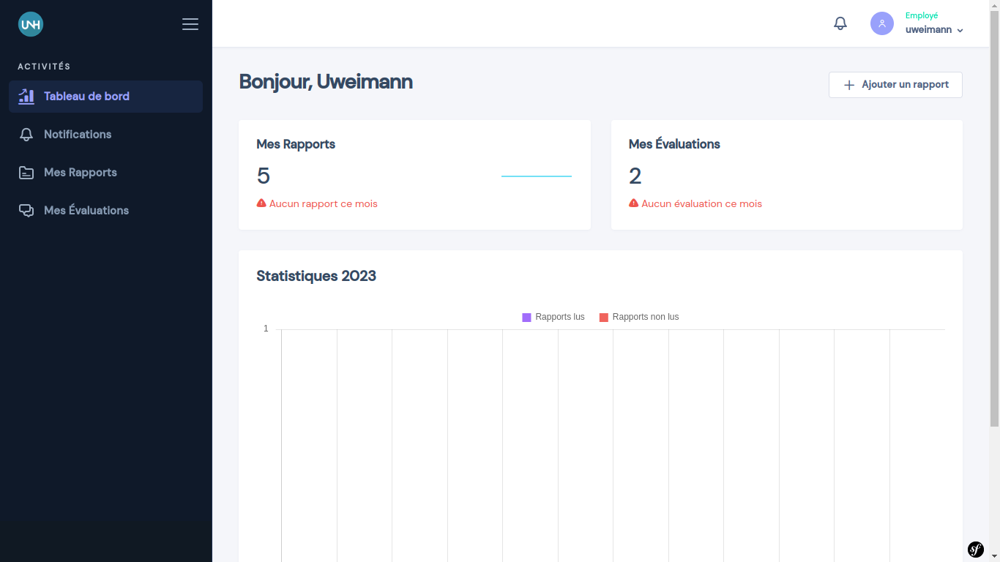
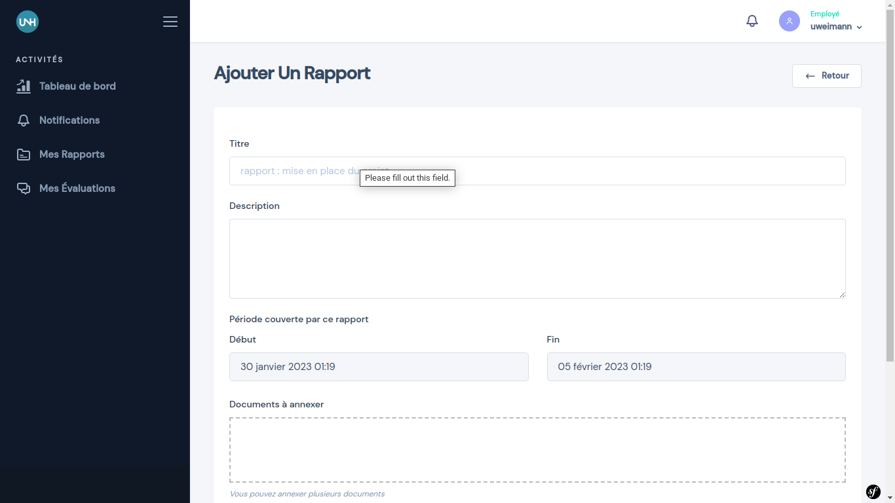

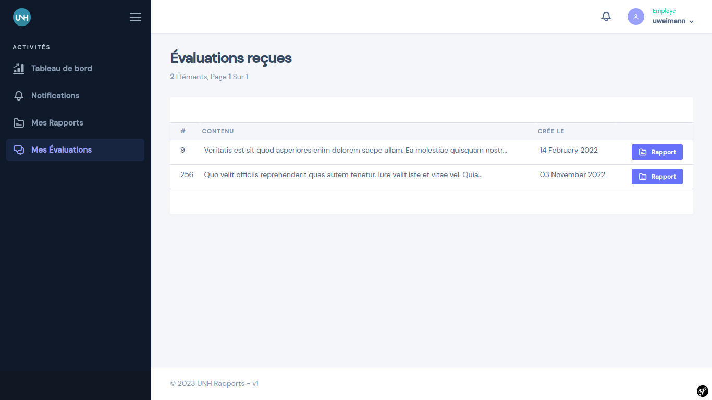
